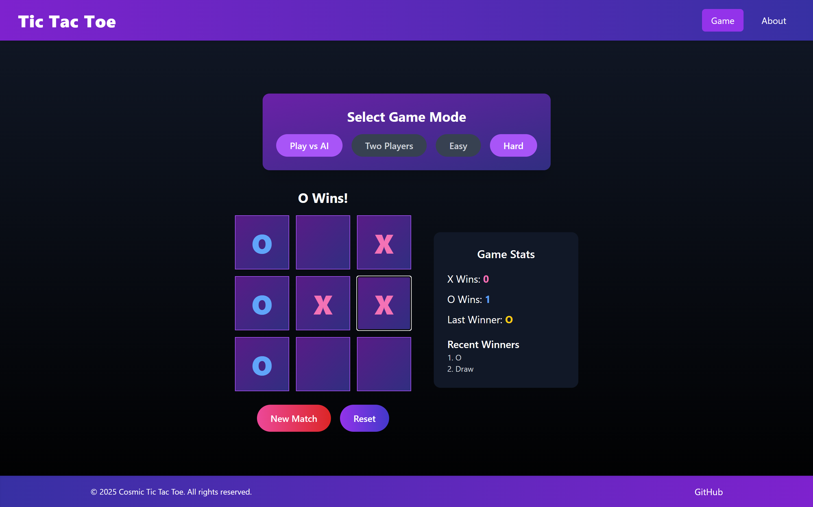
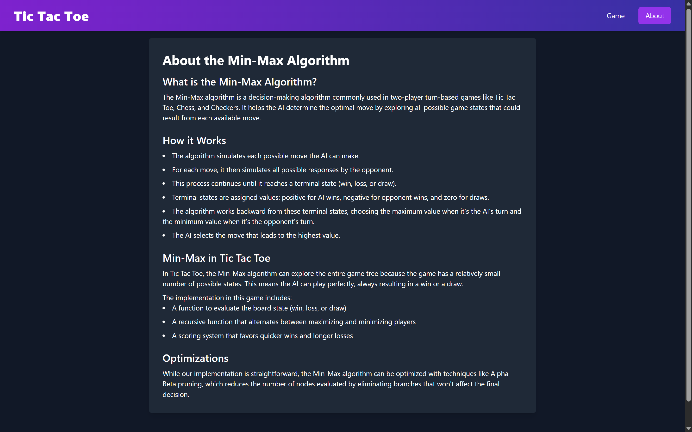

# 🔮 AI Tic Tac Toe Game

A stylish and smart Tic Tac Toe game built using **React**!  
Play against an intelligent AI with difficulty levels or challenge a friend in Two Player mode.  
Includes a beautiful UI, game stats tracker (wins for X and O), last match winner display, and intuitive controls.

---

## ✨ Features

- 🎮 Play vs AI (Easy / Hard modes)
- 👥 Two Player Mode
- 🧠 AI uses Minimax Algorithm for Hard difficulty
- 📊 Game stats:
  - Number of wins for X and O
  - Last match winner display
- 🔄 Restart current match or reset all stats
- 💅 Responsive, animated UI using Tailwind CSS

---

## 🧠 AI Intelligence

The AI uses the **Minimax Algorithm** in Hard mode to play optimally and challenge the user.  
Easy mode selects moves randomly for a more casual experience.


## 🖼️ Screenshots






---

## 🛠️ Installation & Running Locally

### 1. Clone the Repository
```bash
git clone https://github.com/your-username/tic-tac-toe-ai.git
cd tic-tac-toe-ai
```

### 2. Install Dependencies
```bash
npm install
```

### 3. Start the App
```bash
npm start
```

### 4. Open in your browser
```url
http://localhost:3000
```

---


---

## 🧑‍💻 Tech Stack

- **React**
- **Tailwind CSS**
- **Minimax Algorithm**
- **Custom Hooks and State**

---


## 💡 Author

**Sunil Rathod**  
[GitHub](https://github.com/sunil0336) • [LinkedIn](https://www.linkedin.com/in/sunil-rathod-18b1511b5/)

> ⚠️ Don’t forget to ⭐ the repo if you liked it!
